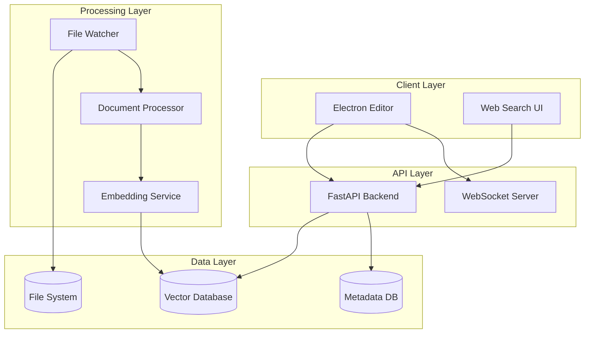

# Architecture Overview

This document provides a detailed technical overview of Writigo's architecture and design decisions.

## System Architecture

### High-Level Components

## Design Principles

### 1. Local-First Architecture
- All data stored locally by default
- Offline-capable operations
- Optional cloud synchronization

### 2. Plugin-Based Extensibility
- Core functionality in plugins
- Well-defined plugin APIs
- Hot-swappable components

### 3. Real-Time Collaboration
- Conflict-free replicated data types (CRDTs)
- Operational transformation for text editing
- Distributed version control via Git

## Component Details

### Electron Editor
- **Technology**: Electron, React, TypeScript
- **Responsibilities**: 
  - Local vault management
  - Markdown editing and preview
  - File tree navigation
  - Real-time collaboration UI

### File Watcher Service
- **Technology**: Python, `watchdog`
- **Responsibilities**:
  - Monitor filesystem changes
  - Debounce rapid changes
  - Trigger ingestion pipeline

### Document Ingestion Pipeline
- **Technology**: Python, LangChain
- **Responsibilities**:
  - Extract text from various formats
  - Chunk documents semantically
  - Generate embeddings
  - Store in vector database

### RAG API Layer
- **Technology**: FastAPI, Python
- **Responsibilities**:
  - Semantic search endpoints
  - LLM integration
  - Authentication and authorization
  - Real-time WebSocket connections

## Data Flow

### Document Processing Flow
1. **File Change Detection** - Watcher detects file modifications
2. **Content Extraction** - Extract text from supported formats
3. **Chunking** - Split content into semantic chunks
4. **Embedding Generation** - Create vector embeddings
5. **Storage** - Store embeddings and metadata
6. **Indexing** - Update search indices

### Search Flow
1. **Query Processing** - Parse and validate search query
2. **Embedding** - Convert query to vector representation
3. **Retrieval** - Find similar document chunks
4. **Ranking** - Score and rank results
5. **Generation** - Generate response using LLM
6. **Response** - Return formatted results with sources

## Security Architecture

### Authentication
- JWT-based authentication
- API key management
- Role-based access control

### Data Protection
- Encryption at rest for sensitive data
- Secure API communication (HTTPS/WSS)
- Local-first privacy model

### Access Control
- File-level permissions
- User-based access control lists
- Secure multi-tenancy support

## Scalability Considerations

### Horizontal Scaling
- Stateless API design
- Microservice architecture
- Container-based deployment

### Performance Optimization
- Vector database indexing
- Caching strategies
- Lazy loading for large vaults

## Technology Decisions

### Why Electron?
- Cross-platform desktop support
- Rich ecosystem for text editing
- Integration with web technologies

### Why Python for Backend?
- Rich ML/AI ecosystem
- Excellent text processing libraries
- Fast development cycle

### Why Yjs for Collaboration?
- Proven CRDT implementation
- Real-time synchronization
- Conflict-free merging
